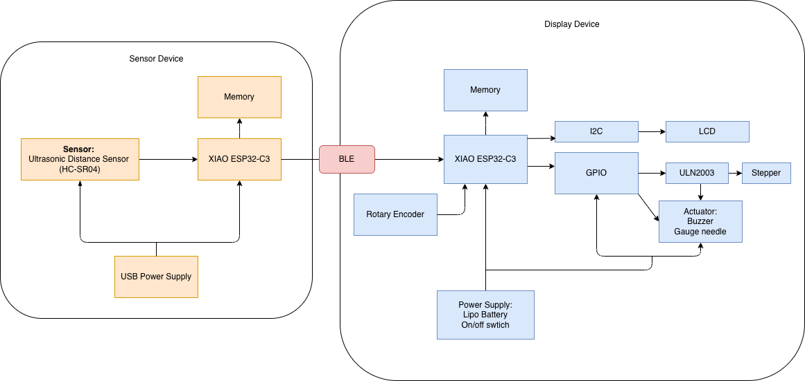
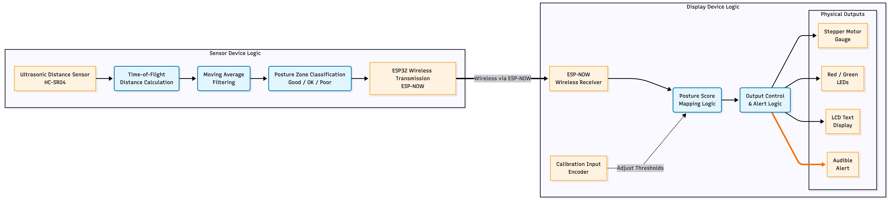

# 1️⃣ Working Posture Monitor

**Working Posture Monitor** is a wireless desk-based posture monitoring system that helps users maintain healthy sitting habits by tracking the distance between the user and the desk. The system classifies posture quality in real time and provides visual and auditory feedback to encourage ergonomic behavior.

The system consists of a sensing unit placed on the desk facing the user and a display device that shows posture status using a gauge needle, LEDs, LCD text, and buzzer alerts.

## Sketch:

# 2️⃣ Sensor Device

The sensor device is placed on the laptop facing the user and measures the distance between the user and the laptop using an ultrasonic sensor. The ESP32 microcontroller applies moving average filtering to smooth the distance signal and classifies posture into **Good**, **OK**, and **Poor** zones based on calibrated thresholds. 

Posture zones are defined as:
- **Good:** distance ≥ **70 cm** (healthy sitting posture)
- **OK:** distance between **45–70 cm** (slight forward leaning)
- **Poor:** distance ≤ **45 cm** (excessive forward leaning)

The posture score is then transmitted wirelessly to the display device using **BLE**.

## Hardware Components & Purpose

1. **XIAO ESP32-C3**

   Acts as the main controller for the sensing unit. It reads distance data from the ultrasonic sensor, applies signal processing (moving average filtering and threshold classification), and transmits posture scores wirelessly to the display device using ESP-NOW.

2. **Ultrasonic Distance Sensor: HC-SR04**

    Measures the distance between the user and the desk by emitting ultrasonic pulses and calculating the echo time. The measured distance is used as the primary indicator of sitting posture quality.

3. **USB Power Supply**

    Provides continuous power to the sensing unit during desk use. USB power ensures stable operation without battery maintenance on the sensor side.

## Sensor Device Sketch:

# 3️⃣ Display Device

The display device receives posture scores from the sensor unit via ESP-NOW and provides real-time ergonomic feedback using multiple output modalities. Visual indicators allow users to quickly understand posture status, while sound alerts notify users when poor posture persists.

## Hardware Components & Purpose

1. **XIAO ESP32-C3**
    Receives posture data wirelessly from the sensor device and controls all output components including the gauge needle, LEDs, LCD display, buzzer, and rotary encoder input.

2. **X27 Stepper Motor**
    Drives an analog-style needle to represent posture score or distance level, allowing users to intuitively understand posture quality at a glance.

3. **NeoPixel (Red and Green)**
Provides color-coded posture feedback: green indicates healthy posture, while red indicates poor posture requiring adjustment.

4. **LCD Display**
    Displays text-based feedback such as “Good”, “OK”, or “Poor”, and can also show short reminders or calibration status.

5. **Buzzer**
    Alert when users have poor posture, encouraging users to correct posture.

6. **Power Supply: 2600 mAh Rechargeable Battery**
    Enables portable desktop placement without requiring constant USB connection.

7. **1 tac Switch**
    turn on/off the device

## Display Device Sketch:

# 4️⃣ Diagram

## System Block Diagram

## Electrical Schematics

## Functional Diagram

